# OpsPilot: Discord-Native AI On-Call Team

A multi-agent ops copilot that triages incidents and ships safe PRs in minutes. Automated incident response with human oversight.

## 🎥 Demo Video

<div align="center">
  <!-- Clickable Screenshot -->
  <a href="https://www.youtube.com/watch?v=48Rrrp5pHG0" target="_blank">
    
  </a>
  
  <!-- Buttons Inline on Same Line -->
  <br><br>
  <a href="https://www.youtube.com/watch?v=48Rrrp5pHG0" target="_blank">
    <button style="padding: 10px 20px; font-size: 16px; background-color: #0EA5E9; color: white; border: none; border-radius: 5px; cursor: pointer; margin-right: 10px;">
      Watch Demo
    </button>
  </a>
  
  <a href="https://opspilot-five.vercel.app/" target="_blank">
    <button style="padding: 10px 20px; font-size: 16px; background-color: #2563EB; color: white; border: none; border-radius: 5px; cursor: pointer;">
      Website
    </button>
  </a>
</div>


## 🚀 Quick Start

### Prerequisites
- Node.js 18+
- Docker Desktop
- Discord & GitHub accounts

### Setup
```bash
# Clone & install
git clone <your-repo> opspilot
cd opspilot
npm install

# Start infrastructure
npm run docker:up
npm run db:init

# Configure environment
cp apps/orchestrator/.env.example apps/orchestrator/.env
cp apps/discord-bot/.env.example apps/discord-bot/.env
# Edit .env files with your credentials

# Build & run
npm run build
npm run dev

# Register Discord commands
npm run register:commands
```

---

## 🧩 System Architecture

```mermaid
flowchart TD
    A[💬 Discord Bot] <--> B[⚙️ ADK-TS Orchestrator]
    B <--> C[🧠 MCP Servers]

    A --> D[🖥️ User Interface]
    D --> E[🤖 Agents: Watcher, Triage, Fixer]
    E --> F[🔗 Integrations: GitHub, Jira, PagerDuty, Prometheus, Runbooks]
```



### Core Services
- **Orchestrator**: AI agents (Watcher, Triage, Fixer) with memory
- **Discord Bot**: User interface for incident management  
- **MCP Servers**: Tool integrations (GitHub, Jira, PagerDuty, Prometheus, Runbook)
- **PostgreSQL**: Incident storage + pgvector for semantic search
- **Redis**: Job queue and caching


## What It Does

1. **Alert Detection**: Watcher agent monitors Prometheus alerts
2. **Auto-Triage**: Analyzes incidents, queries metrics, identifies root causes  
3. **Smart Fixes**: Generates PRs using runbook knowledge with approval gates
4. **Seamless Integration**: Links incidents to Jira tickets, PagerDuty, GitHub PRs
5. **Continuous Learning**: Updates runbooks from resolved incidents


## Running & Testing

```bash
# Start all services
npm run dev

# Or run separately
npm run dev:orchestrator
npm run dev:bot

# Test the system
npm run test:demo
```

The demo simulates real incidents and shows the full workflow from alert → triage → PR creation.

Built with ❤️ by **Himanshu Soni — aka h30s**
